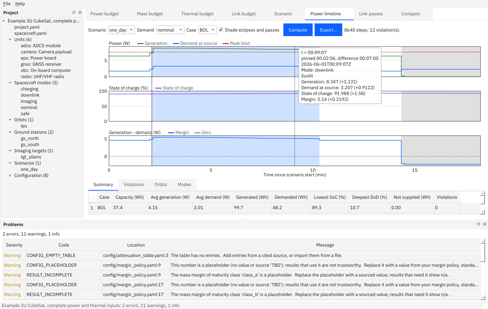

# System Budget Studio

An offline desktop and command-line tool that computes **power, mass, thermal and radio-link budgets** for a small satellite from one spacecraft model kept in plain text files.

[](https://github.com/0h3xn4/systembudgetstudio/actions/workflows/ci.yml)




## What is this?

Satellite teams keep power modes, eclipse cycles, battery depth of discharge, masses, temperatures and link margins in spreadsheets that drift apart. System Budget Studio replaces them with one model: you describe the spacecraft (units and their power modes, solar array, battery, radios, antennas), an orbit and some ground stations, and the tool computes the budgets, shows where a limit is broken, and writes reports.

It runs entirely on your own computer. There is no cloud service, no telemetry and no update check. Every number you enter carries its **source**, every number you have not yet sourced is marked as a **placeholder** (and the results that depend on it say *n/a* instead of guessing), and the same input always gives the same output files.

If you know a little Python and nothing about this tool, start with the [getting-started guide](docs/getting-started.md).

## Quick start

You need Python 3.11, 3.12 or 3.13 and git. On Linux also read the [prerequisites](docs/getting-started.md#1-prerequisites) (the window needs one system library).

```bash
git clone https://github.com/0h3xn4/systembudgetstudio.git
cd systembudgetstudio
python3 -m venv .venv && source .venv/bin/activate     # Windows: py -3 -m venv .venv ; .venv\Scripts\Activate.ps1
pip install -e .
budget --version                                       # System Budget Studio 0.1.0
budget export-examples demo                            # four example projects with invented data
budget validate demo/cubesat_3u_eps                    # check the project: 0 errors, a few warnings
budget run demo/cubesat_3u_eps --budget power --out out   # power budget as XLSX, PDF, DOCX, JSON and CSV
system-budget-studio demo/cubesat_3u_eps               # open the window
```

The reports in `out/` are the first result. [Getting started](docs/getting-started.md) shows what you should see at each step and walks through a first worked example.

## Where to go next

| I want to… | Read |
|---|---|
| Install the tool and get a first result | [Getting started](docs/getting-started.md) |
| See every guide on one page | [Documentation index](docs/README.md) |
| Do a specific task (build a project, run a budget, compare two revisions…) | [User manual](docs/user-manual/README.md) |
| Look at the example projects and what they show | [Examples](examples/README.md) |
| Fix an error message | [Troubleshooting](docs/troubleshooting.md) and the [FAQ](docs/faq.md) |
| Look up a word (BOL, EIRP, Eb/N0, placeholder…) | [Glossary](docs/glossary.md) |
| Work faster | [Tips and shortcuts](docs/tips.md) |
| See the file format of a project | [Project file format](docs/FILE_FORMAT.md) |
| Understand how the tool is built, or contribute | [Contributing](CONTRIBUTING.md) and [developer docs](docs/developer/README.md) |
| See what changed | [Changelog](CHANGELOG.md) |

## Features

- **Power budget**: average and peak power per spacecraft mode with maturity and system margins; a time-domain budget over an orbit scenario (solar array, battery, state of charge, depth of discharge, energy balance per orbit) for beginning and end of life, with every violation time-stamped.
- **Mass budget**: roll-up with margins, centre of gravity and inertia, mission phases and mass limits.
- **Thermal budget**: heat dissipation per unit, subsystem and mode, and a steady-state node model with hot and cold cases checked against unit temperature limits.
- **Link budget**: EIRP, path loss, G/T, C/N0, Eb/N0 and margin at chosen elevations, and over every ground-station pass with the data rate that closes and the data volume per pass and per day; uplink and downlink; several links per project.
- **Scenarios**: eclipses and passes from a two-line element set (TLE) or orbital elements, a mode timeline built from rules (for example "downlink during every pass") and segments; orbits can also be imported from [SpaceMissionStudio](docs/ENVIRONMENT_FORMAT.md).
- **Reports**: XLSX, PDF and DOCX in classic review layouts, CSV for every table and series, JSON for other tools. Every output carries provenance (tool and library versions, project revision, scenario, time, user) and is reproducible byte for byte.
- **Comparison**: two project revisions, or two scenarios, side by side with the differences listed.
- **Guided mode**: a wizard from an orbit to a first budget with a sample spacecraft; an offline user guide (HTML and PDF) with a generated *Equations and sources* chapter.
- **Plain-language problems**: every message names the file and field, says what is wrong and what to change; a double-click jumps to it.

Not in version 1: data-storage budgets, transient thermal simulation, interference analysis, importing unit tables from CSV or XLSX, a separate expert mode. See [decision D-099](docs/DECISIONS.md).

## Requirements

- Python 3.11, 3.12 or 3.13 (checked in CI on Windows and Ubuntu with 3.11 and 3.13).
- Windows 10/11 or Linux (RHEL/Rocky 8 or newer, Ubuntu LTS). macOS is not tested.
- No administrator rights and no internet access are needed after the install. For an air-gapped machine see [offline install](docs/getting-started.md#offline-install).
- Self-contained installers for Windows and Linux are built by CI but no release has been published yet; until then install from source as above.

## Licence and status

Internal use. There is deliberately **no LICENSE file** (the project's decision, see [the specification](docs/SPEC.md#open-decisions)); third-party licences are listed in [docs/LICENCES.md](docs/LICENCES.md) (the program uses PySide6 under the LGPL-3.0, and IBM Plex fonts under the SIL Open Font License, see [assets/fonts](assets/fonts/OFL-IBM-Plex.txt)).

Status: version 0.1.0, all planned milestones (M0 to M6) are done and tested ([plan and history](docs/PLAN.md)). The example projects contain **invented data only**; the tool ships no standards values, so every real number, with its source, is yours to enter.

## Related tools

System Budget Studio belongs to a family of offline engineering tools: SpaceMissionStudio (orbit, eclipse and pass data; the only tool this one reads from today), Harness Design Studio, Requirements Studio, AIT Logbook and ICD Studio. [Tips](docs/tips.md#working-with-the-other-tools) says exactly what can be exchanged with each.

Next: [Getting started](docs/getting-started.md).
