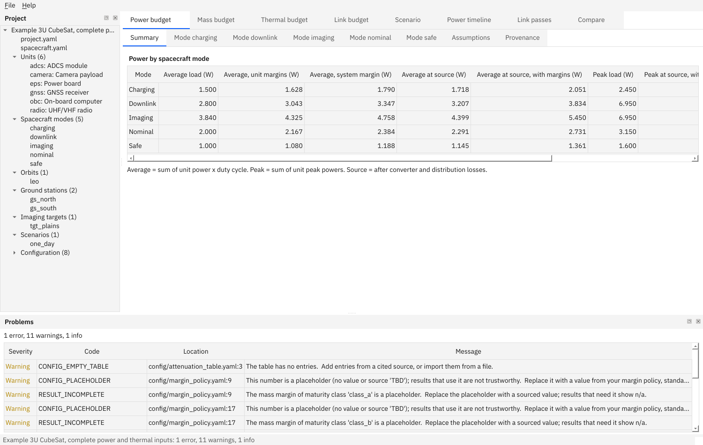

# Getting started

This page takes you from nothing to a first result: install the tool, run a budget on an example project, open the window, and fix a violation the tool finds.

**Contents:** [1. Prerequisites](#1-prerequisites) · [2. Install](#2-install) · [3. Check the install](#3-check-the-install) · [4. Your first budget](#4-your-first-budget) · [5. A first worked example: find and fix a power violation](#5-a-first-worked-example-find-and-fix-a-power-violation) · [6. Open the window](#6-open-the-window) · [Offline install](#offline-install) · [Installers](#installers)

## 1. Prerequisites

| You need | Check with | Notes |
|---|---|---|
| Python 3.11, 3.12 or 3.13 | `python3 --version` (Windows: `py -3 --version`) | 3.14 and newer are not supported yet. |
| git | `git --version` | Only to download the source. You can also download a ZIP from GitHub. |
| A terminal | | Windows: PowerShell. Linux/macOS: any shell. |

**Linux only: one system library for the window.** The Qt window needs `libxcb-cursor0`. Without it the window does not open and you see *"Could not load the Qt platform plugin xcb"* (see [troubleshooting](troubleshooting.md#the-window-does-not-open-on-linux)). The command-line tool does not need it.

```bash
sudo apt install libxcb-cursor0          # Ubuntu / Debian
```

On RHEL or Rocky the window needs the Qt libraries listed in the user guide chapter *Installing and uninstalling* ([source](../src/budget_core/guide/chapters/12-installation.md)). If it still reports the xcb-cursor message, find the package that provides the file with `dnf provides '*/libxcb-cursor.so.0'` and install it.

**macOS** is not tested. The tool should run from source (Python and Qt are cross-platform), but nobody has checked it.

## 2. Install

Use a virtual environment so the tool's libraries stay out of your system Python.

Linux and macOS:

```bash
git clone https://github.com/0h3xn4/systembudgetstudio.git
cd systembudgetstudio
python3 -m venv .venv
source .venv/bin/activate
pip install -e .
```

Windows (PowerShell):

```powershell
git clone https://github.com/0h3xn4/systembudgetstudio.git
cd systembudgetstudio
py -3 -m venv .venv
.venv\Scripts\Activate.ps1
pip install -e .
```

If PowerShell says *running scripts is disabled*, run `Set-ExecutionPolicy -Scope Process -ExecutionPolicy RemoteSigned` once in that window and activate again.

`pip install -e .` installs the runtime libraries only (PySide6, pydantic, numpy, sgp4, ReportLab, openpyxl, python-docx, pint, Pillow, ruamel.yaml). It takes about a minute and needs no compiler. After it, two commands exist inside the environment:

- `budget`: the command-line tool;
- `system-budget-studio`: the window.

Every time you open a new terminal, activate the environment again (`source .venv/bin/activate`, or `.venv\Scripts\Activate.ps1`) from the repository folder.

## 3. Check the install

```bash
budget --version
budget self-test
```

You should see:

```text
System Budget Studio 0.1.0
Self-test passed.
```

`self-test` computes a small budget and renders it as XLSX, PDF and DOCX, and builds the user guide, using only the installed files. If it fails, it says what; see [troubleshooting](troubleshooting.md).

## 4. Your first budget

The tool ships four example projects with **invented data**. Copy them somewhere you can write:

```bash
budget export-examples demo
```

```text
cubesat_3u
cubesat_3u_eps
microsat_150kg
stress_200_units
```

Check one project. `validate` reads every file of the project folder and lists what is wrong or still open:

```bash
budget validate demo/cubesat_3u_eps
```

```text
config/attenuation_table.yaml:3: warning CONFIG_EMPTY_TABLE: The table has no entries. (at entries)
    Add entries from a cited source, or import them from a file.
config/margin_policy.yaml:6: warning CONFIG_PLACEHOLDER: This number is a placeholder (no value or source 'TBD'); results that use it are not trustworthy. (at classes.class_a.power_margin_ratio)
    Replace it with a value from your margin policy, standard or data sheet and cite the source.
…
0 errors, 6 warnings.
```

Reading it: each problem is `file:line: severity CODE: message (at field)` and a hint on the next line. **Warnings** are open items, here the *[placeholders](glossary.md#placeholder)*: numbers the tool will not invent (the margin policy, the mass limit, the Eb/N0 table). **Errors** would stop a budget from being computed. Add `--strict` to treat warnings as failures too.

Compute the static power budget and write the reports:

```bash
budget run demo/cubesat_3u_eps --budget power --out out
```

```text
Wrote out/power_static.xlsx
Wrote out/power_static.pdf
Wrote out/power_static.docx
Wrote out/power_static.json
Wrote out/power_static_charging.csv
Wrote out/power_static_downlink.csv
…
Wrote out/power_static_provenance.csv
0 errors, 6 warnings.
```

Open `out/power_static.xlsx` (or the PDF). You see the average and peak power of each spacecraft mode, with and without margins; the last sheets list the configuration numbers used with their sources, the equations, the problems and the provenance. Entries that depend on a placeholder show **n/a** and the report starts with an **INCOMPLETE** banner: that is the tool refusing to present guesses as results. Leave out `--budget power` to compute power, mass, thermal and link budgets in one go.

## 5. A first worked example: find and fix a power violation

Question: *does the example CubeSat's solar array and battery support its operating modes over one day?* This needs the time-domain budget, which steps through an orbit scenario.

**Step 1: run it.**

```bash
budget power-timeline demo/cubesat_3u_eps --out out
```

```text
Wrote out/power_time_one_day.xlsx
…
BOL: generated 99.7 Wh, lowest state of charge 89.3 %, 0 violation(s).
EOL: generated 93.8 Wh, lowest state of charge 89.0 %, 0 violation(s).
config/power_system.yaml: error PEAK_POWER_EXCEEDED: The peak power demand at the source exceeds the power limit. 12 interval(s), the first at T+00:02:06. (at limits.peak_power_w)
    Open the violations table for every interval; change the input named here or the scenario.
1 error, 0 warnings.
```

**What it says.** BOL and EOL are *[beginning* and *end of life](glossary.md#bol-eol)* (the array is new, or aged by its design life; see the [glossary](glossary.md)). The battery never gets below 89 % charge, so there is no battery problem. But the demand at the power source exceeds the **[peak power limit](glossary.md#peak-power)** during 12 intervals, the first starting 2 minutes 6 seconds into the scenario. The command ends with exit code 1 because it found an error; scripts can use that.

**Step 2: look at the details.** `out/power_time_one_day_violations.csv` has one row per interval, with start and end time, the worst value, the limit and the input to change:

```text
case,code,start_s,end_s,duration_s,…,worst_value,limit,unit,file,path
,PEAK_POWER_EXCEEDED,126.126,619.344,493.218,…,7.961054,7.500000,W,config/power_system.yaml,limits.peak_power_w
```

The worst demand is 7.96 W and the limit is 7.5 W, in `config/power_system.yaml` at `limits.peak_power_w`. The intervals are the downlink passes: the radio transmits.

**Step 3: decide.** You can reduce the demand (change the scenario or the radio's modes) or change the limit **if you have a better, sourced value**. For this example we only want to see the effect, so raise the invented limit. Open `demo/cubesat_3u_eps/config/power_system.yaml` in a text editor and find:

```yaml
limits:
  peak_power_w:
    value: 7.5
    source: Synthetic example value; not from a data sheet or a standard.
```

Change `value: 7.5` to `value: 8.5`. In a real project you would also change the `source` to say where the new number comes from.

**Step 4: run again.**

```bash
budget power-timeline demo/cubesat_3u_eps --out out
```

```text
BOL: generated 99.7 Wh, lowest state of charge 89.3 %, 0 violation(s).
EOL: generated 93.8 Wh, lowest state of charge 89.0 %, 0 violation(s).
0 errors, 0 warnings.
```

Exit code 0: the violation is gone. You have now done the core loop of the tool: **describe, compute, read the findings, change an input, compute again**. To see exactly what a change did, [compare the two revisions](user-manual/compare.md).

## 6. Open the window

```bash
system-budget-studio demo/cubesat_3u_eps
```

You should see the window below: the **project tree** on the left, one **tab per budget** (Power budget, Mass budget, Thermal budget, Link budget, Scenario, Power timeline, Link passes, Compare), and the **Problems** panel at the bottom.



- The **Power budget** tab is the table you saw in the XLSX file.
- In the **Power timeline** tab click **Compute** to run the scenario you ran above. Hover over a plot to read the values at that time; the wheel zooms, dragging pans, a double-click shows everything again, a click pins a second cursor (the readout then shows differences) and Escape unpins it. The shaded bands are eclipses and passes. Click a row of the **Violations** table to zoom to that interval.
- Double-click a row of the **Problems** panel to jump to the file and line it names. Double-click a file in the tree to edit it; **Ctrl+S** saves, and the budgets update.
- **File → Export reports** (Ctrl+E) writes the same files as the command line.
- **File → New project (guided)** (Ctrl+N) builds a new project from a sample spacecraft in five short pages.

On Linux without a display (a server, a container) set `QT_QPA_PLATFORM=offscreen` to run the window without showing it. That is only useful for tests: `system-budget-studio --smoke` creates the window and exits.

## Offline install

The tool never needs the internet while running. To install it on a machine without internet access, first collect the wheels on a connected machine **of the same operating system and Python version**:

```bash
pip download -r requirements.lock -d wheelhouse     # the runtime libraries, pinned with hashes
pip download hatchling editables -d wheelhouse      # needed to build the package itself
```

Copy `wheelhouse/` and the source folder to the offline machine, create the virtual environment there, and run from the source folder:

```bash
pip install --no-index --find-links wheelhouse --require-hashes -r requirements.lock
pip install --no-index --find-links wheelhouse --no-deps -e .
budget --version
```

The lock file (`requirements.lock`) pins every runtime library with a hash, so what you install is exactly what was tested.

## Installers

CI builds a Windows installer (per user, no administrator rights), a Windows portable ZIP and a Linux tarball with `install.sh`. **No release has been published yet**, so for now install from source as above. When a release exists the steps are in the user guide chapter *Installing and uninstalling* ([source](../src/budget_core/guide/chapters/12-installation.md)) and the [clean-machine checklist](INSTALL_CHECKLIST.md).

Next: the [user manual](user-manual/README.md) (task by task), the [examples](../examples/README.md), or [troubleshooting](troubleshooting.md) if something did not work.
